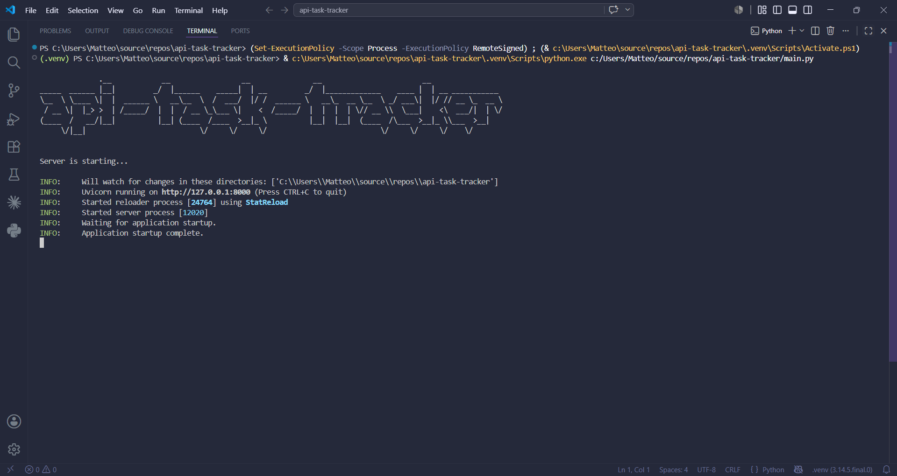
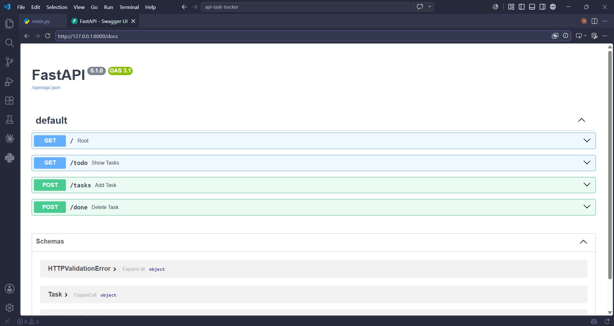
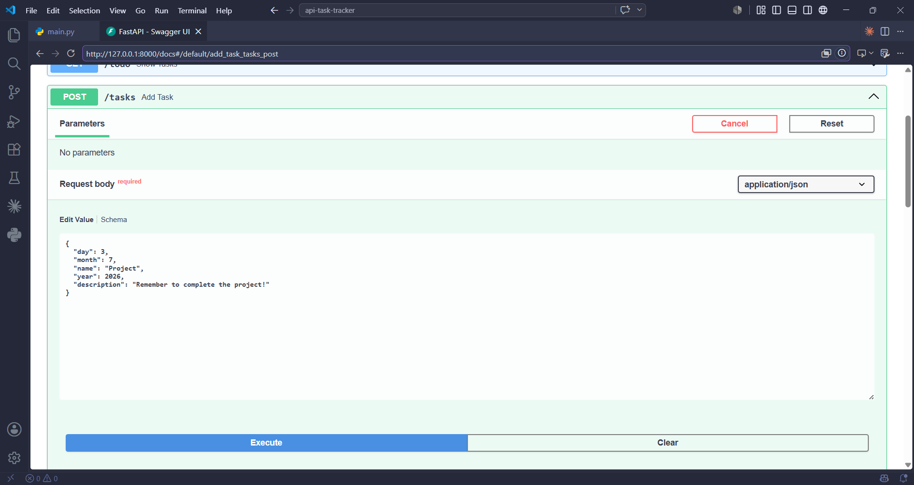
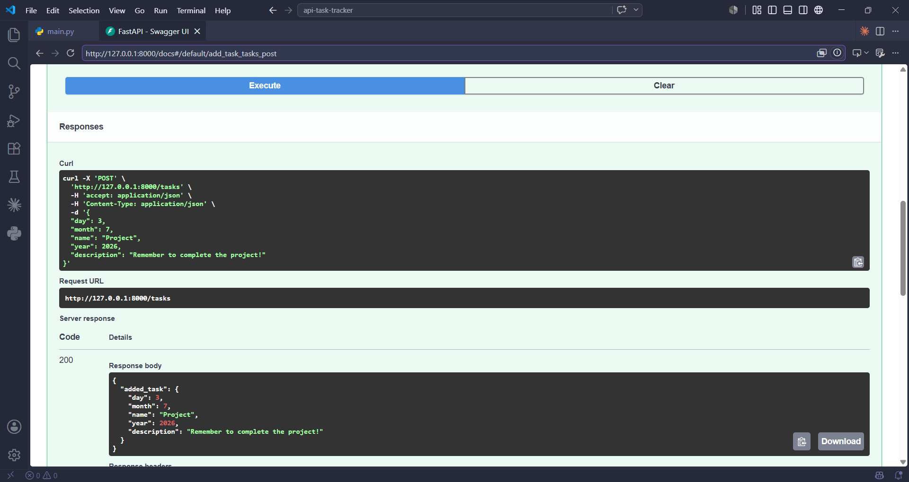
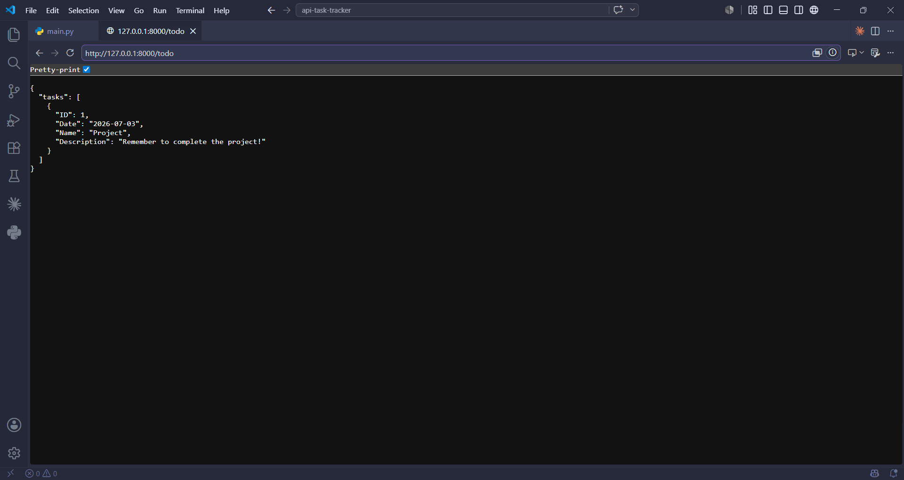
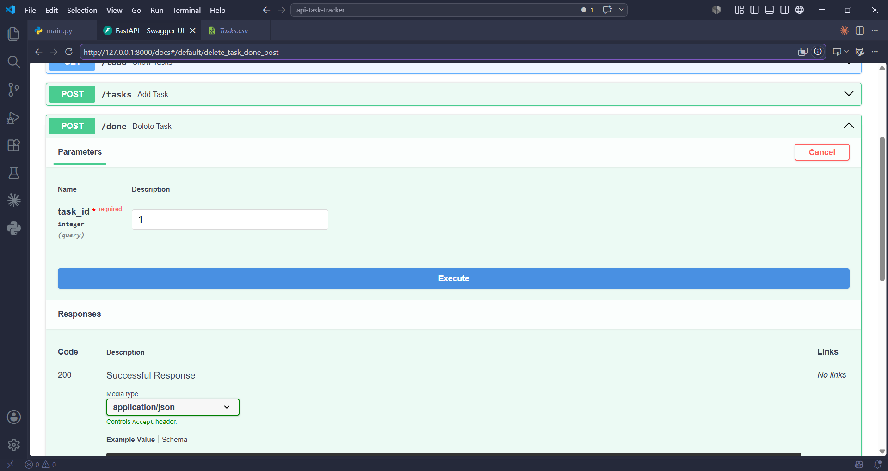
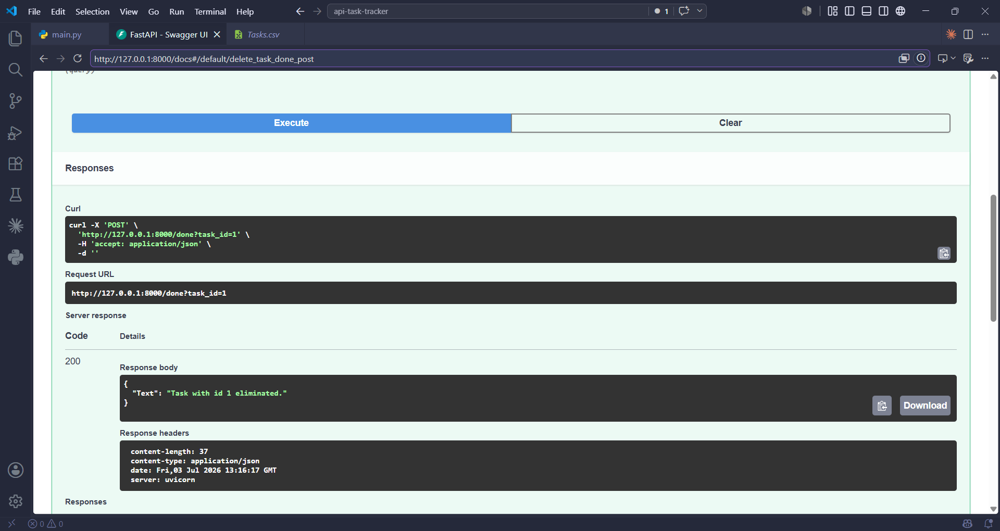

<p align="right">
  <a href="README.it.md">🇮🇹 Italiano</a> ·
  <a href="CONTRIBUTING.md">Contributing</a> ·
  <a href="LICENSE">License</a>
</p>

```
              .__            __                 __               __                        __
_____  ______ |__|         _/  |______    _____|  | __         _/  |_____________    ____ |  | __ ___________
\__  \ \____ \|  |  ______ \   __\__  \  /  ___/  |/ /  ______ \   __\_  __ \__  \ _/ ___\|  |/ // __ \_  __ \
 / __ \|  |_> >  | /_____/  |  |  / __ \_\___ \|    <  /_____/  |  |  |  | \// __ \\  \___|    <\  ___/|  | \/
(____  /   __/|__|          |__| (____  /____  >__|_ \          |__|  |__|  (____  /\___  >__|_ \\___  >__|
     \/|__|                           \/     \/     \/                           \/     \/     \/    \/
```

# api-task-tracker

A lightweight REST API to track daily tasks, built with **FastAPI** and **pandas**. Tasks are persisted to a CSV file and can be created, listed (for the current day) and marked as done through simple HTTP endpoints.

This project was built as a learning exercise to practice REST API design, request validation and basic data persistence in Python.

## Features

- Create tasks with a name, description and due date (day/month, with optional year)
- Retrieve the list of tasks due **today**
- Mark a task as done (removes it from the tracker)
- Request validation with Pydantic (field lengths, date ranges, etc.)
- Automatic interactive API documentation via Swagger UI (`/docs`)
- Simple CSV-based storage — no database setup required

## Tech Stack

[](https://www.python.org/)
[](https://fastapi.tiangolo.com/)
[](https://docs.pydantic.dev/)
[](https://www.uvicorn.org/)
[](https://pandas.pydata.org/)
[](data/Tasks.csv)

## Screenshots

<details>
<summary>Click to expand</summary>

**Server startup**


**Interactive docs (Swagger UI) — available endpoints**


**Adding a task — `POST /tasks` request**


**Adding a task — response**


**Listing today's tasks — `GET /todo`**


**Completing a task — `POST /done` request**


**Completing a task — response**


</details>

## Getting Started

### Prerequisites

- Python 3.11+ (developed and tested with Python 3.14)
- pip

### Clone the repository

```bash
git clone https://github.com/cacciottim/api-task-tracker.git
cd api-task-tracker
```

### Set up a virtual environment

```bash
python -m venv .venv
```

Activate it:

```bash
# Windows (PowerShell)
.venv\Scripts\Activate.ps1

# macOS / Linux
source .venv/bin/activate
```

### Install dependencies

```bash
pip install -r requirements.txt
```

### Run the app

```bash
python src/main.py
```

The server starts at `http://127.0.0.1:8000`. Interactive API documentation is available at `http://127.0.0.1:8000/docs`.

## API Usage

| Method | Endpoint | Description                          |
|--------|----------|---------------------------------------|
| GET    | `/`      | Health-check / welcome route          |
| GET    | `/todo`  | Returns tasks due today               |
| POST   | `/tasks` | Adds a new task                       |
| POST   | `/done`  | Marks a task as done (deletes it)     |

### Add a task

```bash
curl -X POST 'http://127.0.0.1:8000/tasks' \
  -H 'Content-Type: application/json' \
  -d '{
    "day": 3,
    "month": 7,
    "name": "Project",
    "year": 2026,
    "description": "Remember to complete the project!"
  }'
```

`year` is optional (defaults to the current year) and `description` is optional. `day`, `month` and `name` are required.

### List today's tasks

```bash
curl 'http://127.0.0.1:8000/todo'
```

### Mark a task as done

```bash
curl -X POST 'http://127.0.0.1:8000/done?task_id=1'
```

## Project Structure

```
api-task-tracker/
├── assets/          # Screenshots used in this README
├── data/            # CSV storage (Tasks.csv)
├── src/
│   ├── main.py      # Entry point — starts the app
│   ├── utils.py     # App factory, routes and business logic
│   └── schemas.py   # Pydantic models for request validation
└── requirements.txt # Project dependencies
```

## Contributing

Contributions, issues and suggestions are welcome — see [CONTRIBUTING.md](CONTRIBUTING.md) for guidelines.

## License

This project is licensed under the MIT License — see [LICENSE](LICENSE) for details.

## Acknowledgments

Parts of this project were reviewed and debugged with the help of [Claude](https://claude.com/) (Anthropic).
